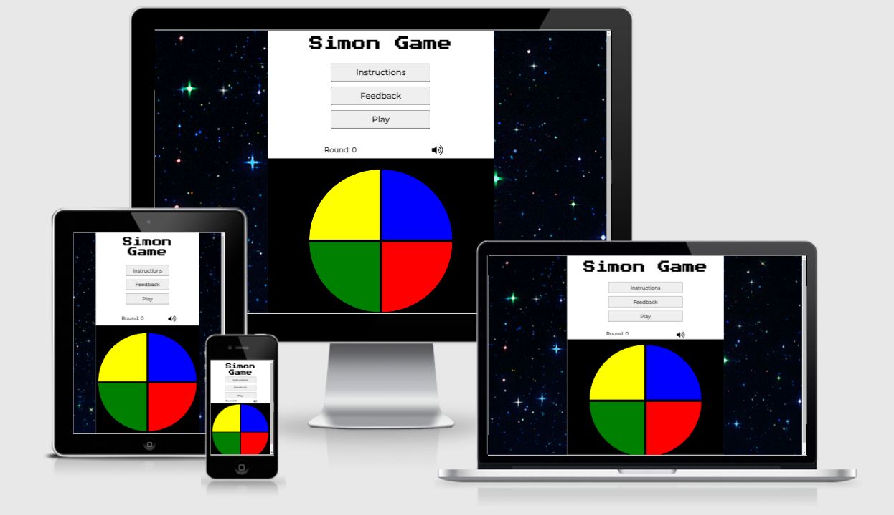

# Simon Game Project

## Introduction
  Welcome to my second milestone project which focuses on the JavaScript language. This project is a browser version of the retro game Simon. 
  Simon is a memory game where the program flashes a series of lights and requires a user to repeat the sequence. 
  If the user succeeds, the series becomes progressively longer and more complex. 
  The game is over if the user fails to repeat the correct pattern or if the user complete 10 rounds, winning the game.

  A live version of the game can be found [here](https://marcellomuy.github.io/ci-milestone-p2/).

  

## Table of Contents
[1. User experience (ux) design:](#ux)
  - [User Goals:](#user-goals)
  - [Typography:](#typography)
  - [Site skeleton:](#site-skeleton)

[2. Features](#features)

[3.Technologies used](#technologies-used)

[4.Testing](#testing)

[5.Bugs](#bugs)

[6.Deployment](#deployment)

[7.Credit](#Credit)

  
# 1. User experience (UX) design
  [Go to the top](#table-of-contents)
  
  This website was designed to be simple and easy to navigate with large buttons, clear text and high contrast between colours. Instructions buttons were added to guide the user on how to play the game. It also contains a feedback button giving the user the ability to contact the creator of the game.

  
## 1.1 User Goals
  [Go to the top](#table-of-contents)

  As a user I expect:
  * A website that is responsive to different screens sizes.
  * Clear instructions on how to play. 
  * Ability to restart the game at any time.
  * Be able to check which round I am on.
  * Be able to navigate the game without reloading the page.
  * A game that increases the speed after few rounds.
  * An option to play with no sound.

 
## 1.2 Typography
  [Go to the top](#table-of-contents)
  
  Two fonts were used for this design. 'Press Start 2p'  for logo and Montserrat for the other elements, Sans Serif was used as a backup font in both cases.

 
## 1.3 Site Skeleton
  [Go to the top](#table-of-contents)

  [balsamiq](https://balsamiq.com/) was used to create the wireframes for the website.

  The website consists of only one page with the content of buttons generated using JavaScript.
  
  The mobile version wireframes are presented below.

  
### Game Screen:
  

  
### Instructions Screen:
  

  
### Feedback Screen:
  

  The website consists of only one page with the content of buttons generated using JavaScript.
  The only difference between the mobile and desktop versions is that on desktop a container is added around the game and a gif image is added as a background. The game, buttons and content are displayed in the same format as the mobile version.
  
  The desktop version wireframe is presented below.
  
  
### Desktop Game Screen:
  

  
# 2. Features
  [Go to the top](#table-of-contents)
  
  
## Game screen:
  - The logo is placed in the top centre of the page. On small screens the two words are displayed in different lines and on larger screens they are displayed on the same line.
  - Under the logo there is an instructions button, a feedback button, and a play button.
  - The three buttons are placed in the centre of the page and each one on a different line. All three buttons have the same style properties to keep the page consistent.

### Mobile:
  

### Desktop:
  
  
### Instructions button:
  

  - When clicked, the instructions button generates paragraphs containing the instructions of the game and a close button. It will also hide itself from the page displaying only the content. 
  - The paragraphs were created using template literals.
  - The close button has the same styling of the other buttons of the page, but it is smaller. When clicked, the close button will hide all the content including itself and will unhide the instructions button. 
  - If the instructions button is clicked a second time it will skip the process of generating new content and unhide the content already created.

### Feedback button:
    

  - The feedback button works in a similar way as the instructions button but will generate a form instead of paragraphs.
  - The form has three inputs, first name, last name and email and a text area for the feedback.
  - All the inputs have the required attribute on, a place holder, labels, and aria-labels.
  - Under the text area there are two buttons - one for submit and one for close. The close button works the same way as the instructions close button hiding and unhiding the content. 
  - The submit button will submit the form and the code institute form dump is displayed.

### Play button:
  

  - The third button is the play button. When clicked it will start the game and will also change itself into a restart button.
  - When the restart button is clicked it sets the game parameters to default and turns itself back into the play button. 
  - The game is then ready to be played again.

### Rounds counter and mute icon:
  

  - Under the buttons we have the rounds counter which keeps track of which round in the game is being played. 
  - It is justified aligned to the page, with a margin left. 
  - On the right side of the rounds counter we have a volume icon that works as a button, muting the page when clicked and unmuting when clicked again. 
  - The icon will change to represent the mute and unmuted state. 
  - The page starts with the audio option set to on.

### Gameplay:
  #### Wrong Pattern
  

  #### Speed up
  

  #### Winning message
  

  - At the bottom of the page, we can find the game board. 
  - The game board consists of a black box with four clickable panels of different colours.
  - Each panel was styled to create a full circle.
  - When the sequence is played the panel will flash white and a sound is played.
  - When the user interacts with the panel it will also flash white, and a different sound is played.
  - The user is only able to click the panels when the game is on, and the sequence has finished.
  - The game will automatically speed up after the round 4.
  - If the user clicks a wrong pattern the black board will flash red and a different sound to indicate wrong pattern is played.
  - The game parameters will be set to default and the game is ready to be played again.
  - If the user completes the round 10 a winning message is displayed with a restart button and a winning image below.
  - The restart button will reload the page when clicked.

  
# 3. Technologies Used
  [Go to the top](#table-of-contents)
  
  * [HTML5](https://en.wikipedia.org/wiki/HTML5) (markup language) was used for structuring and presenting content of the website.
 
  * [CSS3](https://en.wikipedia.org/wiki/CSS) (Cascading Style Sheets) was used to style the content written in HTML.

  * [JS](https://en.wikipedia.org/wiki/JavaScript) (JavaScript) was used to create the game functionality and make the website interactive of the game

  * [Balsamiq](https://balsamiq.com/) was used to create the wireframes of the website.

  * [Google Fonts](https://fonts.google.com/) was used to import font-family 'Press Start 2p' and Montserrat into style.css file

  * [Font Awesome](https://fontawesome.com/) was used to import icons.

  * [Chrome](https://www.google.com/intl/en_uk/chrome/) was used to debug and test the source code as well as to test site responsiveness.

  * [Github](https://github.com/) was used to create the repository and to store the project's code after pushed from Git.

  * [Gitpod](https://www.gitpod.io/) was used as the Code Editor for the site

  * [W3C Markup](https://validator.w3.org/)  was used to validate the HTML code used in the project.

  * [Jigsaw validation](https://jigsaw.w3.org/) was used to validate the CSS style used in the project.

  * [JSHint](https://jshint.com/) was used to validate the JS script used in the project.

  * [Giphy](https://giphy.com/) was used to find the gif image for the background of the desktop version.

  * [Bandican](https://www.bandicam.com/) was used to record the game screen. 

  * [Ezgif](https://ezgif.com/) was used to convert videos into gif files.

  * [Ami](http://ami.responsivedesign.is/#) was used to generate a screenshot showing responsiveness in different devices. 

  
# 4. Testing
  [Go to the top](#table-of-contents)

## 4.1 Testing With Tools

### Chrome DevTools
  I used the developer tools to debug my code. If the game behaved in way that I didn’t expect I would check the console for errors and use the debugger to figure out what part of the code was causing it.

### Responsive Tools
  I used [Am I Responsive](http://ami.responsivedesign.is/) in conjunction with Chrome DevTools to check how the website behaved in different screen sizes.

### W3C Validator Tools 

 - I used [W3C Markup](https://validator.w3.org/) to check my code for any errors in the HTML pages.
    
    I had an error indicating that I didn’t put !DOCTYPE at the top of the HTML file. The problem was fixed by adding it to the file.

    The screenshot of the validator showing no errors is below:

    

  - I used [Jigsaw validation](https://jigsaw.w3.org/) to check my code for any CSS errors.

    Found errors for not specifying the metric unit for some numeric values. Fixed the problem by adding the metric unit after the value.

    The screenshot of the validator showing no errors is below:

    

  - I used [JSHint](https://jshint.com/) to check my code for JavaScript errors.

    Found errors for missing semicolon in parts of the code. Fixed the problem by adding it.
    
    Found errors for undefined variables. Fixed it by adding let before i in the if statements. 
    
    Found error indicating that expected a conditional expression and instead saw assignment. Fixed error by using == instead of = in if statements.

    Errors for async functions and unused variables were ignored.  

    The screenshot of the validator showing no errors is below:

    

### Lighhouse Testing

  

## Manual Testing 

I have tested my website on Google Chrome and Firefox on different screens.
  - Mobile (320 x 568)
  - iPhone 6/7/8 Plus (412 x 736)
  - iPad (768 x 1024)
  - Laptop (1280 x 802)
  - Desktop (1600 x 992)

Please find below my testing process for all pages via mobile and web:

### Text
  - Check if the fonts were loaded and all text was displayed in the correct size in different screen sizes. Pass

### Responsive
  - All elements were responsive using different break points. Pass.

### Images
  - Check if all images were loaded, weren’t distorted and were responsive for different break points. Pass.

### Instruction button
  - Button creates paragraphs with game instructions and hides itself when clicked. Pass.
  - Button creates a close button when clicked. Pass.
  - Close button hides the paragraphs and itself when clicked. Pass.
  - Instructions button display the same paragraphs when clicked for the second time, not generating new ones. Pass.

### Feedback button
  - Button creates a form and hides itself when clicked. Pass.
  - Button creates a submit and a close button when clicked. Pass.
  - Submit button only submits the form if required attributes are filled. Pass.
  - Close button hides the form and itself when clicked. Pass.
  - Feedback button display the same form when clicked for the second time, not generating a new one. Pass.

### Play button
  - Play button starts the game and becomes a restart button clicked. Pass.
  - The restart button set the game parameters to default when clicked. Pass.

### Rounds counter
  - Rounds counter get increased by one at each round. Pass.
  - Rounds counter is set to zero if the game restart. Pass.

### Mute icon 
  - Mute icon toggles between volume up and no sound icons when clicked. Pass.
  - Mute icon mutes the sounds when clicked and unmutes it when clicked again. Pass.

### Game Board
  - Game board Flashes red and play sound if the user clicks a wrong pattern. Pass.
  - Each panel flashes white when clicked and play a sound. Pass.
  - The game generates a different pattern every time it is played. Pass.
  - The pattern is increased by one at each round. Pass.
  - The user can’t click the panels while the sequence is being played or if the game hasn’t started yet. Pass.

### Winning message
  - The game displays a winning message, creates a restart button and displays the winning image after the user completes 10 rounds. Pass.
  - The restart button reloads the page when clicked. Pass.
  
  
# 5. Bugs
  [Go to the top](#table-of-contents)

### Solved Bugs
  - User Sequence was being filled with repeated colours making the game crash after one round. Problem fixed by setting the user array to empty at the start of the computer sequence.
  - User was able to click the panels before the end of computer sequence. Fixed the problem by creating a Boolean to control when the user was allowed to click.
  - If the user clicked twice while the panel was still flashing the game would jump rounds, adding extra colours to array. Fixed the problem by preventing the user to click while panel was still flashing. 
  - When input fields with required attributes where hidden from the page the console would through a form control error. The Problem was fixed by removing required attribute when inputs where hidden and adding it back when they were unhidden.
  - If the user clicked panels repeatedly the console would through an error of flashing = null. Problem was fixed by creating an if statement saying if flashing equals null continue.

  
# 6. Deployment
  [Go to the top](#table-of-contents)

  The project was deployed using Github. The process is described below:

  - Create a new Github repository.
  - Click on settings on the repository page.
  - Click on pages in the Options menu.
  - Go to the source area, select main branch and save.
  - A link for your site project will be generated.
  - Live link for this project [here](https://marcellomuy.github.io/ci-milestone-p2/). 

  
# 7. Credit
  [Go to the top](#table-of-contents)

## Media 
  * The gif image used as background came from [Giphy](https://giphy.com/).
  * The icons used in the project came from [Font Awesome](https://fontawesome.com).
  * The audio files used in the project came from [Free SFX](https://freesfx.co.uk/).

## Code
  * [W3schools](https://www.w3schools.com/) was used for inspiration when trying to come up with a code to compare the player array and the computer array.
  * I would like to thank my mentor Marcel Mulders for giving me all the support and in special for explaining to me how async functions work.

 

